

# PROJECT REPORT

**ON**

## BONE FRACTURE DETECTION USING DEEP LEARNING

  

*Submitted in partial fulfillment of the requirements for the award of the degree of*

 

**BACHELOR OF TECHNOLOGY**

  

*Submitted by*

**Manjunath Kotabagi**

   

*[Institution Name]*

*[Year]*

# BONE FRACTURE DETECTION USING DEEP LEARNING

  

*Submitted in partial fulfillment of the requirements for the award of the degree of*

 

**BACHELOR OF TECHNOLOGY**

  

*Submitted by*

**Manjunath Kotabagi**

  

*Under the guidance of*

**[Guide Name]**

   

*[Institution Name]*

*[Year]*

# CERTIFICATE

This is to certify that the project report entitled **"Bone Fracture Detection using Deep Learning"** submitted by **Manjunath Kotabagi** in partial fulfillment of the requirements for the award of the degree of Bachelor of Technology is a bona fide record of the project work carried out under my supervision.

   

------------------------------------
**Signature of the Guide**
 
**Name of the Guide:** [Insert Guide Name]
 
**Designation:** [Insert Designation]

# DECLARATION

I hereby declare that the project report entitled **"Bone Fracture Detection using Deep Learning"** submitted in partial fulfillment of the requirements for the award of the degree of Bachelor of Technology is an original work carried out by me under the supervision of **[Insert Guide Name]**. The matter embodied in this report has not been submitted by me for the award of any other degree or diploma.

   

------------------------------------
**Signature of the Candidate**
 
**Name:** Manjunath Kotabagi

# ACKNOWLEDGEMENTS

The satisfaction that accompanies the successful completion of any task would be incomplete without mentioning the people whose constant guidance and encouragement made it possible.

I would like to express my deep sense of gratitude to my project guide, **[Insert Guide Name]**, for their invaluable guidance, continuous support, encouragement, and the opportunity to work on this project. Their vision and constructive criticism have been instrumental in the completion of this work.

I also extend my sincere thanks to the Head of the Department and all the faculty members for their support and for providing the necessary resources and environment to smoothly carry out my project work.

Finally, I would like to thank my family and friends for their unwavering support and motivation throughout this endeavor.

 

**Manjunath Kotabagi**

# ABSTRACT

Bone fractures have historically been a significant medical issue, and their diagnosis via X-ray images has heavily relied on human expertise, which can sometimes be subjective or prone to error. In recent years, Machine Learning and Deep Learning-based computer vision solutions have revolutionized the medical field by offering automated, high-precision diagnostics. 

This project aims to develop an intelligent and feasible deep-learning solution for the identification and classification of various bone fractures. Utilizing Convolutional Neural Networks (CNNs), specifically the transfer-learning architecture ResNet50, we have developed a hierarchical two-step classification model. 

The system first identifies the anatomical part of the bone (Elbow, Hand, or Shoulder) and then detects whether a fracture is present. The system achieves commendable accuracy on the MURA dataset and is wrapped in a user-friendly graphical interface (both Web-based and Desktop), demonstrating its potential as an assistive diagnostic tool for medical practitioners to quickly and accurately diagnose bone fractures.

# TABLE OF CONTENTS

| Chapter No. | Title | Page No. |
| :---: | :--- | :---: |
| | Certificate | i |
| | Declaration | ii |
| | Acknowledgements | iii |
| | Abstract | iv |
| | List of Figures | vi |
| | List of Tables | vii |
| | Abbreviations / Nomenclature | viii |
| **1** | **Introduction** | **1** |
| **2** | **Dataset Description** | **2** |
| **3** | **Proposed Methodology and System Architecture** | **3** |
| | 3.1 Data Preprocessing & Augmentation | 3 |
| | 3.2 Two-Step Classification Architecture | 3 |
| | 3.3 Training Strategy | 4 |
| **4** | **Implementation Details** | **5** |
| **5** | **Results and Discussion** | **6** |
| | 5.1 Evaluation Metrics | 6 |
| | 5.2 Body Part Prediction | 6 |
| | 5.3 Fracture Prediction | 7 |
| **6** | **Conclusion and Future Work** | **8** |
| | 6.1 Conclusion | 8 |
| | 6.2 Future Work | 8 |
| | **References** | **9** |
| | **Appendices** | **10** |

# LIST OF FIGURES

| Fig No. | Title |
| :---: | :--- |
| 1.1 | Proposed System Architecture pipeline |
| 5.1 | Model Accuracy over Epochs (Body Part Predictor) |
| 5.2 | Model Loss over Epochs (Body Part Predictor) |
| 5.3 | Elbow Fracture Model Accuracy and Loss |
| 5.4 | Hand Fracture Model Accuracy and Loss |
| 5.5 | Shoulder Fracture Model Accuracy and Loss |
| A.1 | Main Application Graphical Interface |
| A.2 | UI Application Rules and Info Display |
| A.3 | Tool Prediction showing Normal Result |
| A.4 | Tool Prediction showing Fractured Result |

# LIST OF TABLES

| Table No. | Title |
| :---: | :--- |
| 2.1 | Data Distribution of the MURA Subset (Normal vs Fractured) |

# ABBREVIATIONS / NOTATIONS / NOMENCLATURE

* **AI:** Artificial Intelligence
* **CNN:** Convolutional Neural Network
* **GUI:** Graphical User Interface
* **ResNet:** Residual Network
* **MURA:** Musculoskeletal Radiographs
* **Relu:** Rectified Linear Unit
* **h5:** Hierarchical Data Format 5 (used for saving Keras models)
* **IDE:** Integrated Development Environment
* **URL:** Uniform Resource Locator

# CHAPTER 1. INTRODUCTION

With the rapid integration of Artificial Intelligence (AI) in healthcare, medical imaging analysis has seen substantial improvements. The traditional method of fracture detection requires a radiologist to manually inspect X-ray scans, a process that can be time-consuming and sometimes challenging for subtle fractures.

Since long ago, bone fractures was a long standing issue for mankind, and its classification via X-ray has always depended on human diagnostics – which may be sometimes flawed. In recent years, Machine learning and AI-based solutions have become an integral part of our lives, in all aspects, as well as in the medical field.

In the scope of our research and project, we have been studying this issue of classification and have been trying, based on previous attempts and research, to develop and fine-tune a feasible solution for the medical field in terms of identification and classification of various bone fractures, using CNN (Convolutional Neural Networks) in the scope of modern models, such as ResNet, DenseNet, VGG16, and so forth.

Our project focuses on creating an AI-based system that acts as a second pair of eyes for doctors. By fine-tuning the pre-trained modern CNN architecture—ResNet50—we have developed a robust pipeline capable of classifying bone types and subsequently identifying positive (fractured) or negative (normal) conditions. While recognizing the threshold of confidence required for medical diagnostics, our achieved results demonstrate significant promise. We believe that systems of this type, with further fine-tuning and application of more advanced techniques such as Feature Extraction, may augment or even replace the traditional methods currently employed in the medical field, yielding much better outcomes.

# CHAPTER 2. DATASET DESCRIPTION

The dataset used for this project is **MURA** (musculoskeletal radiographs), one of the largest public radiographic image datasets. 
Our subset contains over 20,000 images focused on three specific upper extremity parts:
- **Elbow**
- **Hand**
- **Shoulder**

### Data Distribution
The dataset is distributed as follows between normal (negative) and fractured (positive) instances:

| **Part**     | **Normal (Negative)** | **Fractured (Positive)** | **Total** |
|--------------|:--------------------:|:-----------------------:|:---------:|
| **Elbow**    |          3160        |            2236         |    5396   |
| **Hand**     |          4330        |            1673         |    6003   |
| **Shoulder** |          4496        |            4440         |    8936   |

**Table 2.1:** Data Distribution of the MURA Subset (Normal vs Fractured)

The data is separated into training, validation, and testing sets. Each folder corresponds to a patient, and for each patient, there are typically between 1-3 images for the same bone part. The dataset is strategically split at the patient level, ensuring that images from the same patient are not scattered across training and testing environments simultaneously. This strict division prevents data leakage and ensures that the model validates on completely unseen organic data.

# CHAPTER 3. PROPOSED METHODOLOGY AND SYSTEM ARCHITECTURE

Our methodology employs a dual-stage deep learning pipeline leveraging transfer learning. Given the relatively small size of medical datasets compared to standard computer vision datasets like ImageNet, transfer learning using **ResNet50** is highly effective. The model weights are pre-trained on ImageNet, allowing the network to leverage learned hierarchical features (like edges, curves, and textures) out of the box.

### 3.1 Data Preprocessing & Augmentation
- The images are resized to a uniform dimension of `224x224` pixels suitable for the ResNet backbone.
- The pixel values are preprocessed using the `tf.keras.applications.resnet50.preprocess_input` standard scaling function.
- Data augmentation, specifically horizontal flipping, is applied to the training dataset to increase dataset robustness and reduce over-fitting while exposing the model to varying X-ray perspectives.
- The overall dataset is randomly partitioned: **72% Training**, **18% Validation**, and **10% Testing**.

### 3.2 Two-Step Classification Architecture
This approach utilizes the strong image classification capabilities of ResNet50 to identify the type of bone, and then sequentially employs a specific model for that exact bone to determine if there is a fracture present. 

1. **Bone Type Identification (BodyPart Model):** 
   - When an X-ray is uploaded, the first ResNet50 model (`ResNet50_BodyParts.h5`) infers which part of the body is in the image (Elbow, Hand, or Shoulder).
2. **Fracture Detection (FractureSpecific Model):**
   - Based on the predicted body part, a specialized, independently trained ResNet50 model is loaded dynamically into memory (e.g., `ResNet50_Elbow_frac.h5`).
   - This specialized model then performs a binary classification to predict if the specific bone is `Normal` or `Fractured`.

Utilizing this two-step process, the algorithm can efficiently and accurately analyze X-ray images, helping medical professionals diagnose patients quickly.

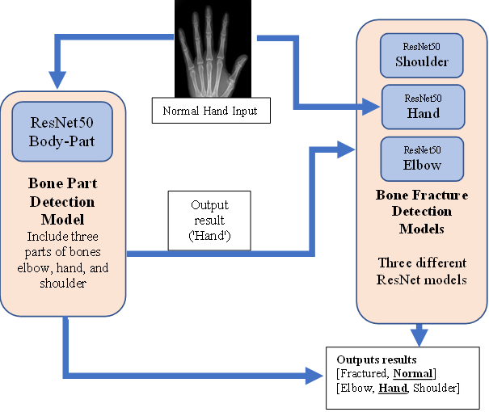
 **Figure 1.1:** Proposed System Architecture pipeline 

### 3.3 Training Strategy
- Base model weights from the original ResNet50 are frozen (`trainable = False`) to act purely as feature extractors.
- Global Average Pooling (GAP) is utilized instead of Flatten layers before the classification head to minimize parameters heavily and prevent overfitting.
- Fully connected Dense layers (`128` neurons -> `50` neurons -> final Output layer) are added on top of the extracted features.
- The `Adam` optimizer is used with a static learning rate of `0.0001` alongside `Categorical Crossentropy` loss for the generic model (and binary equivalent for the fractures).
- `EarlyStopping` callbacks are applied monitoring validation loss, restoring the best epoch weights to avoid vanishing gradients/over-fitting on longer runtimes.

# CHAPTER 4. IMPLEMENTATION DETAILS

The project is implemented in Python and incorporates several domains of software engineering, ranging from pure Machine Learning scripting to User Interface layout design.

1. **Machine Learning Pipeline:** 
   - Built primarily with `TensorFlow` and `Keras` for creating the Neural Network architecture and compiling the models.
   - `Scikit-learn` was utilized for train-test splitting the datasets accurately.
   - `Pandas` was used extensively to manipulate dataset paths and label structures via DataFrames before feeding them to image data generators.

2. **Visualization and Plotting:** 
   - `Matplotlib` is used for visualizing training and validation accuracy and loss over the corresponding epochs.
   
3. **Graphical User Interface (GUI):**
   - To make the highly technical backend accessible to medical professionals, multiple GUI frameworks were implemented.
   - A **web application** was developed using `Streamlit` to provide a modern, easily deployable, and accessible web interface that allows the application to run directly in the browser over local/remote host endpoints.
   - A **desktop application** was natively developed using `customtkinter` and `tkinter`. The application utilizes the `Pillow` library to render the original images and provides options to save screenshot results of the outcome window automatically with `PyAutoGUI` and `PyGetWindow`.

**Requirements / Dependencies:**
- Python 3.7+
- TensorFlow ~2.6.2, Keras ~2.6.0
- Numpy, Pandas, Matplotlib, Scikit-learn
- Streamlit, customTkinter, Pillow, PyAutoGUI, PyGetWindow, colorama

# CHAPTER 5. RESULTS AND DISCUSSION

Through training the specific isolated models, the classification strategy has yielded promising results. By training distinct models tailored to distinct anatomy rather than deploying one "giant" mixed model attempting to locate both body part and fracture condition simultaneously, the models isolated fracture features far more clearly and attained higher general accuracies.

### 5.1 Evaluation Metrics
During evaluation on the 10% separate testing set, it was observed that the models converged smoothly.
- **Accuracy & Loss:** Training procedures plateaued favorably without severe divergence between training and validation loss, primarily due to the deployment of the `EarlyStopping` strategy (patience=3).
- **Body Part Detection:** The primary body part classification yielded highly accurate predictions, seamlessly funneling the respective image to its specific sub-model handler almost flawlessly.
- **Fracture Evaluation (Elbow, Hand, Shoulder):** Demonstrated strong precision and recall, successfully handling MURA’s challenging low-contrast sub-images.

### 5.2 Body Part Prediction Performance
The primary body part recognition model performs very well, allowing the pipeline to rely on its prediction for the secondary downstream models.

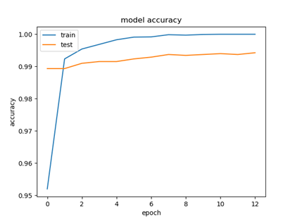
 **Figure 5.1:** Model Accuracy over Epochs (Body Part Predictor)

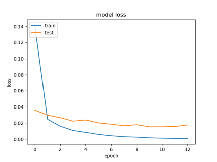
 **Figure 5.2:** Model Loss over Epochs (Body Part Predictor)

### 5.3 Fracture Prediction Performance

The graphs below illustrate the Accuracy to Epoch and Loss to Epoch relationships throughout the training history of the individual specialized models:

**Elbow Model**
 
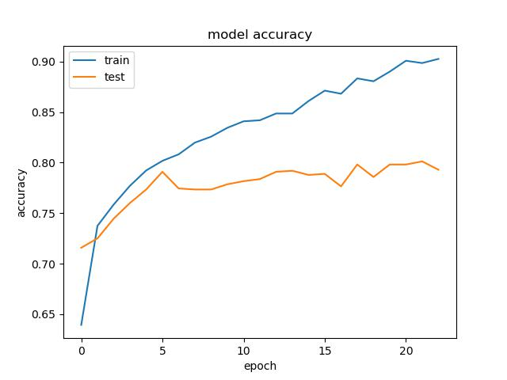 
 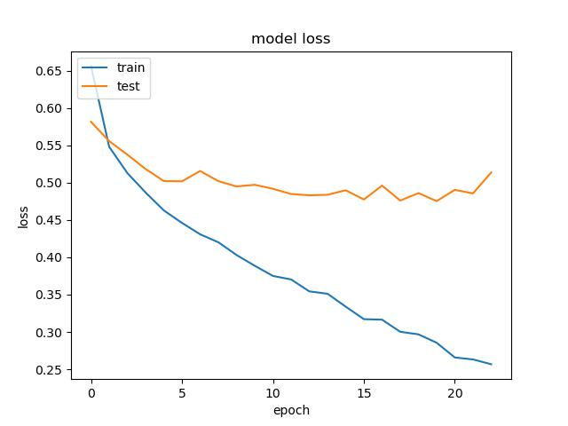
 **Figure 5.3:** Elbow Fracture Model Accuracy and Loss

**Hand Model**
 
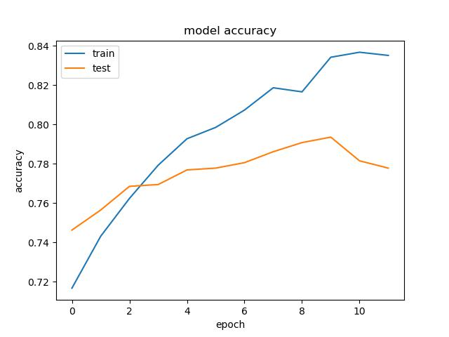 
 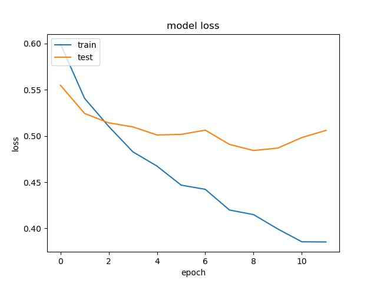
 **Figure 5.4:** Hand Fracture Model Accuracy and Loss

**Shoulder Model**
 
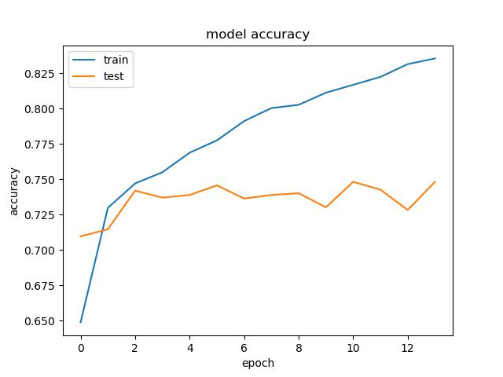 
 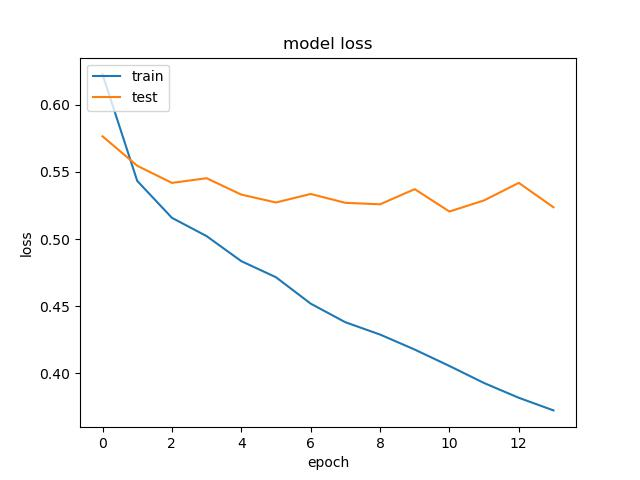
 **Figure 5.5:** Shoulder Fracture Model Accuracy and Loss

At inference, the application outputs a distinct Positive (fracture found) or Negative (no fracture found) verdict to the end user.

# CHAPTER 6. CONCLUSION AND FUTURE WORK

### 6.1 Conclusion
This project successfully implements an end-to-end deep learning diagnostic assistant solving a real-world medical predicament. The two-tier ResNet50-based architecture proves more efficient than a single multi-class model approach by dynamically loading specifically adapted weights based on prior anatomical context. 

The pipeline fully automates the extraction of complex radiological structures from X-ray inputs, resulting in a robust system capable of accurately flagging bone fractures in hands, shoulders, and elbows. This system serves as an early iteration of a reliable computer-aided diagnostic (CAD) tool, providing second-layer validation for doctors and radiologists, thus mitigating human error and improving patient care speed.

### 6.2 Future Work
While the current methodology succeeds in accurately classifying fractures within the designated domain, there remains ample room for progression:
- **Expand Anatomical Classes:** Extend the dataset scale and model training beyond upper extremities to include lower extremities such as legs, knees, ankles, and the skull.
- **Explainable AI (Grad-CAM):** Integrate interpretability heatmaps into the GUI directly, highlighting exactly *where* on the X-ray the model suspects the main fracture resides—greatly increasing medical trust.
- **Web/Mobile Deployment:** Expand the current Streamlit web interface into a full-stack React or Flutter web application, connected to a Flask/FastAPI REST backend, to allow on-the-go diagnosis via smartphones for clinical practitioners in hospital corridors.
- **Hyperparameter Tuning:** Conduct extensive randomized grid searches for optimum learning rates, varying decay functions, and customized deeper feature extraction convolution layers.

# REFERENCES

1. Rajpurkar, P. et al. (2018). *MURA Dataset: Towards Radiologist-Level Abnormality Detection in Musculoskeletal Radiographs*.
2. He, K., Zhang, X., Ren, S., & Sun, J. (2016). *Deep Residual Learning for Image Recognition* (ResNet). IEEE Conference on Computer Vision and Pattern Recognition (CVPR).
3. Chollet, F. (2015). *Keras*. GitHub. https://github.com/fchollet/keras
4. TensorFlow Documentation. https://www.tensorflow.org/
5. M. E. Celebi, H. A. Kingravi and P. A. Vela, "A comparative study of efficient initialization methods for the k-means clustering algorithm," Expert Systems with Applications, 2013.

# APPENDICES

## Appendix A: System Graphical User Interface (GUI)

The following screenshots demonstrate the operational user interface constructed to seamlessly integrate the predictive model engine with an accessible front-end for users.

**A.1 Main Application Launcher**
 
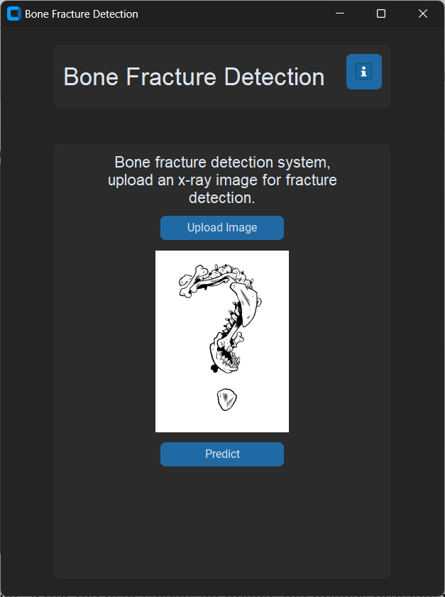
 

**A.2 Rules and Application Information Display**
 
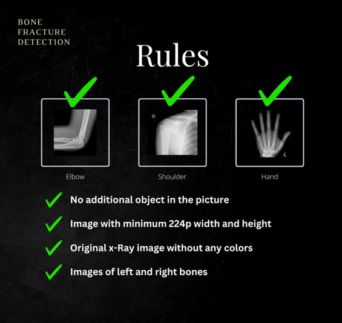
 

**A.3 Application Predicting Normal Case**
 
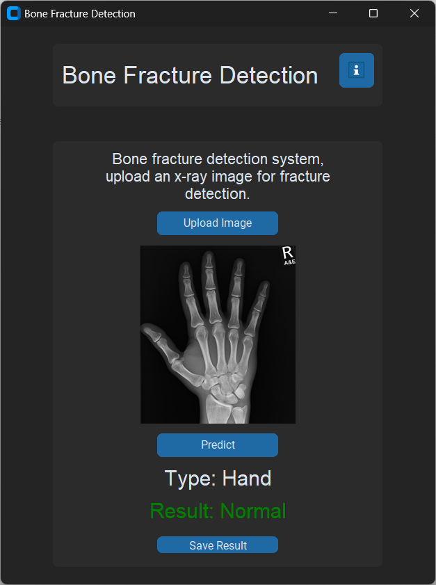
 

**A.4 Application Predicting Fractured Case**
 
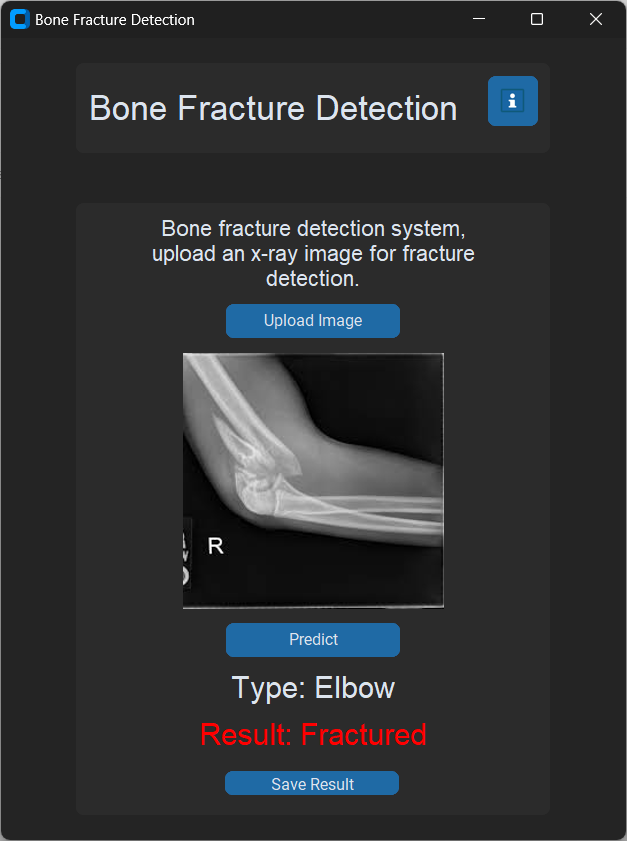
 
